# Slide Craft

**수업과 연수 슬라이드를 만들고, 글과 배치를 직접 다듬으세요.**

교사가 청중, 주제, 활동을 말하면 AI가 **편집하고 발표할 수 있는 HTML 슬라이드**를 만드는 Claude·Claude Code·Codex에서 사용하는 스킬입니다. 질문, 설명, 자료 비교, 참여 활동을 내용에 맞는 장면으로 구성합니다.

예를 들어 “광고의 주장과 근거를 구분하는 중학교 국어 수업”을 요청하면 도입 질문, 광고 비교, 짝 활동 안내가 담긴 슬라이드를 만듭니다. 초안에서 문구를 고치고 요소의 위치와 크기를 조절한 뒤 바로 발표할 수 있습니다.

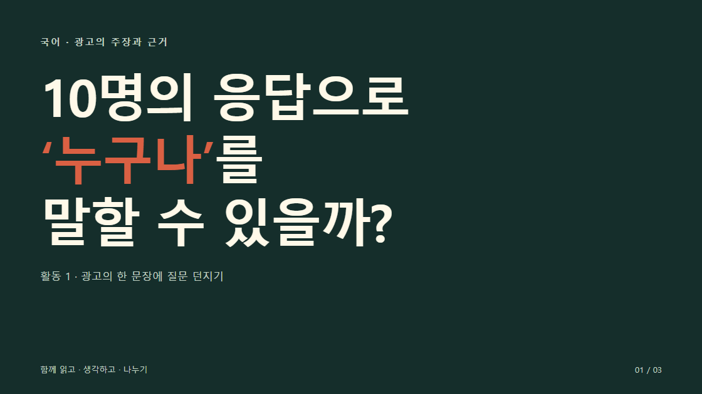

[디자인 둘러보기](#디자인-갤러리) · [설치하고 시작하기](#처음-사용하기) · [편집 기능 보기](#직접-고칠-수-있는-것)

## 디자인 갤러리

**내용의 용도가 아닌 디자인 특징으로 나눈 사례**입니다. 같은 주제도 원하는 분위기에 따라 다른 스타일로 만들 수 있습니다. 한 발표 안에서는 색과 글꼴의 기준을 공유하면서 질문, 설명, 활동에 맞게 배치를 바꿉니다.

### Bold Typography · 큰 글자와 강한 대비

코발트색 바탕, 화면을 채우는 큰 문장, 옅은 노란색 강조으로 시선을 모읍니다. 설명 장면에서는 밝은 바탕과 비교 구도로 전환해 읽는 리듬을 바꿉니다.

위 이미지는 **「광고의 주장과 근거」**의 도입 장면입니다. 아래처럼 질문, 두 열 비교, 단계 안내로 이어집니다.

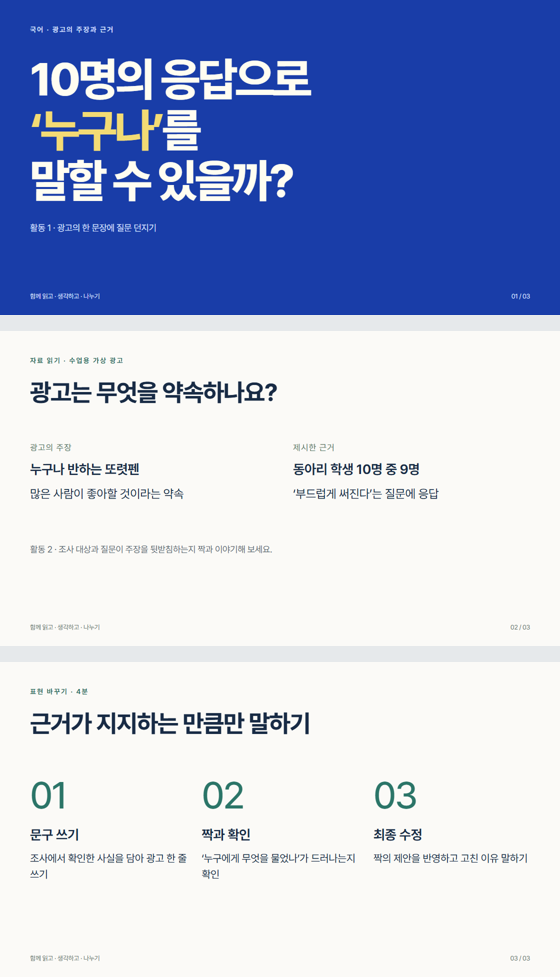

> “Bold Typography 스타일로 만들어 줘. 핵심 질문은 크게, 대비는 강하게, 설명은 짧게. 모든 장의 배치를 똑같이 만들지는 마.”

[3장 전체 HTML](examples/bold-typography.html) · [HTML 바로 내려받기](https://github.com/pblsketch/slide-craft/raw/refs/heads/main/examples/bold-typography.html)

### Swiss Grid · 정렬, 여백, 숫자의 위계

밝은 바탕, 반듯한 정렬, 청색 포인트, 크기가 뚜렷하게 다른 글자를 사용합니다. 숫자·문장·도표를 구분해 읽기 쉽게 배치합니다.

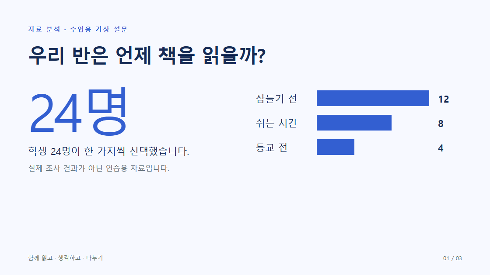

**「우리 반은 언제 책을 읽을까?」** 예시입니다. 수업용 가상 설문을 읽고 자료에서 확인할 수 있는 것과 추가로 물어볼 것을 구분합니다.

> “Swiss Grid 스타일로 만들어 줘. 흰색에 가까운 바탕과 청색을 쓰고, 제목·숫자·설명을 정렬해 줘. 장식은 줄이고 정보의 크기 차이를 살려 줘.”

[3장 전체 HTML](examples/swiss-grid.html) · [HTML 바로 내려받기](https://github.com/pblsketch/slide-craft/raw/refs/heads/main/examples/swiss-grid.html)

### Warm Minimal · 따뜻한 바탕과 차분한 여백

크림색 바탕, 갈색 포인트와 넓은 여백을 사용합니다. 인용문은 큰 따옴표와 넓은 행간으로 강조하고 안내 문장은 간결하게 정리합니다.

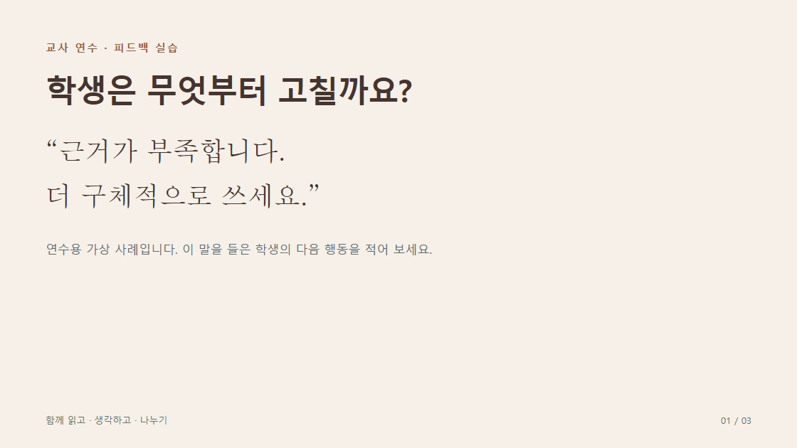

**「다음 행동이 보이는 피드백」** 예시입니다. 사례를 읽고 피드백을 다시 쓴 뒤 동료와 교환하는 연수 흐름을 담았습니다.

> “Warm Minimal 스타일로 만들어 줘. 크림색과 갈색을 조금 쓰고, 인용문은 크게, 활동 안내는 차분하게 배치해 줘.”

[3장 전체 HTML](examples/warm-minimal.html) · [HTML 바로 내려받기](https://github.com/pblsketch/slide-craft/raw/refs/heads/main/examples/warm-minimal.html)

HTML 링크에서 코드가 보이면 파일 화면의 다운로드 버튼 또는 **HTML 바로 내려받기**로 저장한 뒤 브라우저에서 여세요. 예시는 각 3장이며, 실제 발표의 장 수와 화면 비율은 요청에 맞게 바꿀 수 있습니다.

### Duotone Split · 두 색의 큰 면으로 만드는 대비

크림색과 남색 면을 절반씩 나눠 두 개념을 나란히 보여 줍니다. 큰 번호와 짧은 문구로 대비를 만들고, 마무리는 한 가지 배경색으로 전환합니다.

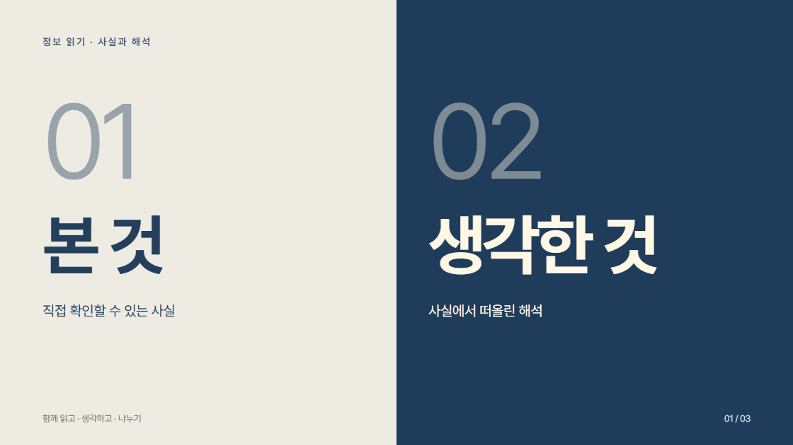

예시: **사실과 해석을 구분하는 3장 수업 자료**. 같은 디자인 방향을 다른 주제나 교과에도 적용할 수 있습니다.

> “Duotone Split 스타일로 만들어 줘. 크림색과 남색을 크게 나누고, 두 관점을 서로 마주 보는 구도로 배치해 줘.”

[편집 가능한 HTML](examples/duotone-split.html) · [HTML 바로 내려받기](https://github.com/pblsketch/slide-craft/raw/refs/heads/main/examples/duotone-split.html)


### Editorial Magazine · 비대칭 배치와 삽화가 있는 잡지형 구성

큰 제목과 말풍선 삽화를 비대칭으로 배치합니다. 종이색 바탕과 벽돌색 포인트를 공유하면서 비교 장면과 실습 장면의 구도를 달리합니다.

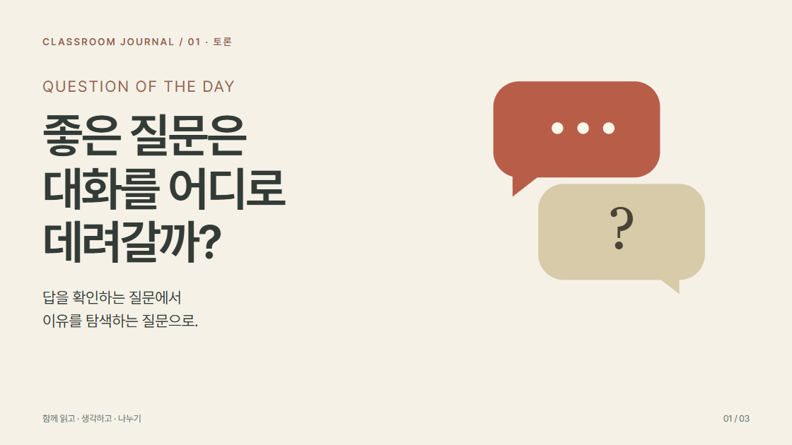

예시: **질문을 바꾸며 대화의 방향을 살펴보는 3장 자료**. 같은 디자인 방향을 다른 주제나 교과에도 적용할 수 있습니다.

> “Editorial Magazine 스타일로 만들어 줘. 큰 제목 옆에 내용과 연결되는 삽화를 넣고, 여백을 살려 잡지처럼 구성해 줘.”

[편집 가능한 HTML](examples/editorial-magazine.html) · [HTML 바로 내려받기](https://github.com/pblsketch/slide-craft/raw/refs/heads/main/examples/editorial-magazine.html)


### Pin & Paper · 종이색과 잉크색, 자유로운 메모 배치

노란 종이와 남색 글자의 대비를 살리고, 자료·메모·성찰을 서로 다른 크기로 배치합니다. 안전핀이나 바인더 구멍을 장식으로 반복하지 않습니다.

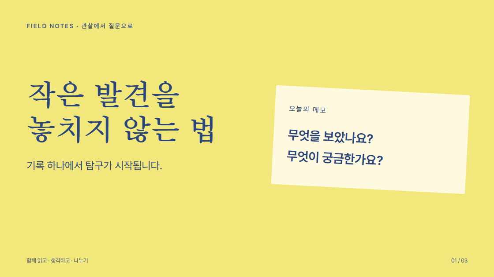

> “Pin & Paper 스타일로 만들어 줘. 이 예시의 시각적 특징을 활용하되, 내용과 쓰는 공간은 내 수업에 맞게 구성해 줘.”

[편집 가능한 HTML](examples/pin-and-paper.html) · [HTML 바로 내려받기](https://github.com/pblsketch/slide-craft/raw/refs/heads/main/examples/pin-and-paper.html)


### Cobalt Grid · 청색 타이포그래피와 정밀한 모눈

코발트색 글자와 정확한 좌표 모눈을 결합합니다. 원본의 모눈과 편집물 같은 인상은 살리되, 픽셀 장식과 강조선은 제거합니다.

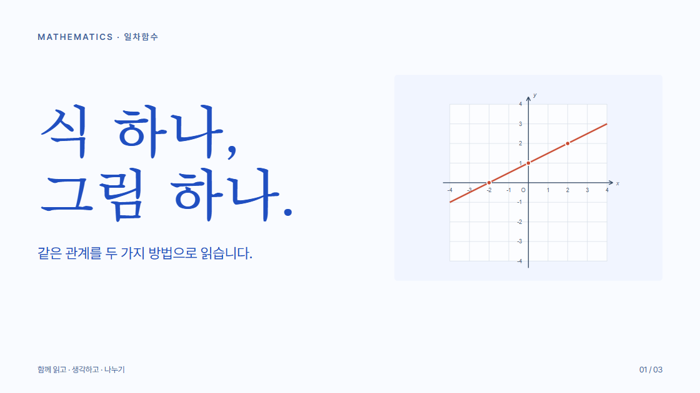

> “Cobalt Grid 스타일로 만들어 줘. 이 예시의 시각적 특징을 활용하되, 내용과 쓰는 공간은 내 수업에 맞게 구성해 줘.”

[편집 가능한 HTML](examples/cobalt-grid.html) · [HTML 바로 내려받기](https://github.com/pblsketch/slide-craft/raw/refs/heads/main/examples/cobalt-grid.html)


### Grove · 숲색과 크림색, 여유 있는 명조 제목

짙은 숲색과 크림색, 명조 제목의 차분한 인상을 활용합니다. 활동지는 밝은 바탕을 넓게 두고 슬라이드는 어두운 장면과 밝은 장면을 섞습니다.

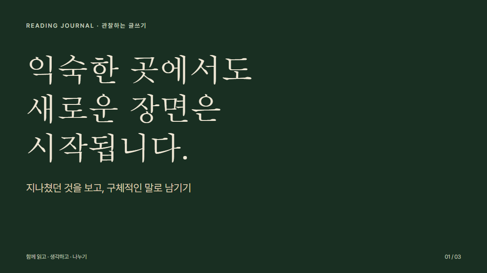

> “Grove 스타일로 만들어 줘. 이 예시의 시각적 특징을 활용하되, 내용과 쓰는 공간은 내 수업에 맞게 구성해 줘.”

[편집 가능한 HTML](examples/grove.html) · [HTML 바로 내려받기](https://github.com/pblsketch/slide-craft/raw/refs/heads/main/examples/grove.html)


### Notebook Tabs · 색인 탭과 종이 지면

색인 탭에 읽기·기록·수정 같은 실제 구역 이름을 붙이고 내용과 연결합니다. 종이색 바탕과 정돈된 칸을 쓰되 바인더 구멍은 넣지 않습니다.

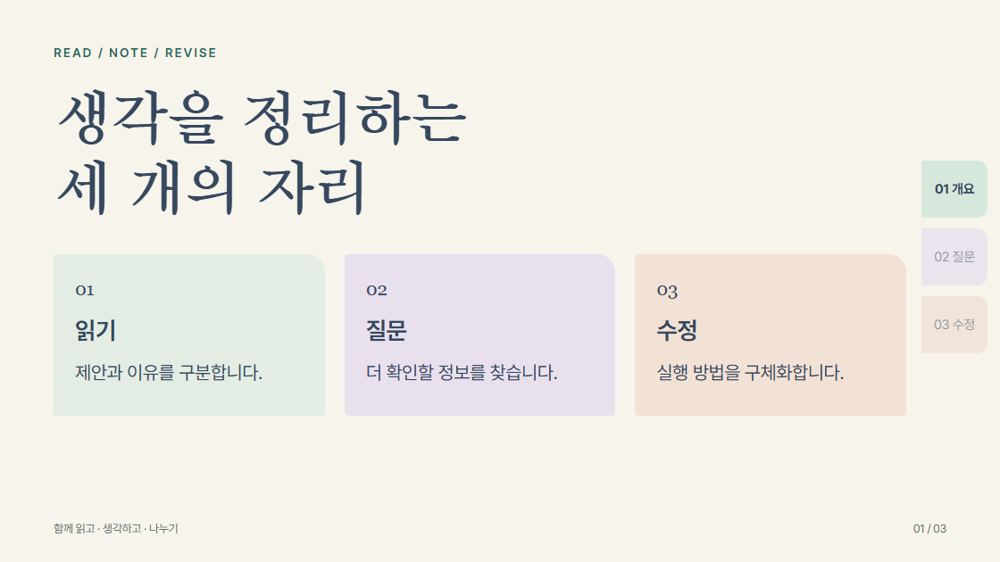

> “Notebook Tabs 스타일로 만들어 줘. 이 예시의 시각적 특징을 활용하되, 내용과 쓰는 공간은 내 수업에 맞게 구성해 줘.”

[편집 가능한 HTML](examples/notebook-tabs.html) · [HTML 바로 내려받기](https://github.com/pblsketch/slide-craft/raw/refs/heads/main/examples/notebook-tabs.html)


### Retro Zine · 독립출판물 같은 글자와 지면

베이지 종이색과 선명한 초록색, 크기가 다른 제목과 메모를 사용합니다. 굵은 제목·비대칭 자료 배치로 인쇄물의 개성을 살립니다.

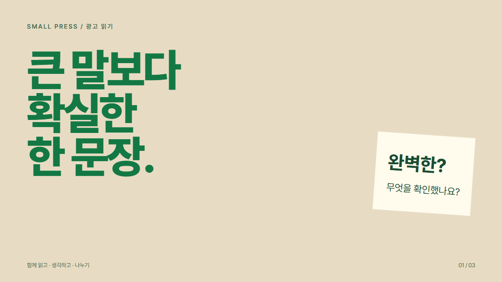

> “Retro Zine 스타일로 만들어 줘. 이 예시의 시각적 특징을 활용하되, 내용과 쓰는 공간은 내 수업에 맞게 구성해 줘.”

[편집 가능한 HTML](examples/retro-zine.html) · [HTML 바로 내려받기](https://github.com/pblsketch/slide-craft/raw/refs/heads/main/examples/retro-zine.html)


### Sakura Chroma · 복고풍 색 조합과 기하학적 구성

크림색 바탕에 분홍·주황·청색을 조합하고 짧은 라벨과 체크 항목을 배치합니다. 색 면은 자료와 구역을 구분하는 데 사용하며 장식용 강조줄은 넣지 않습니다.

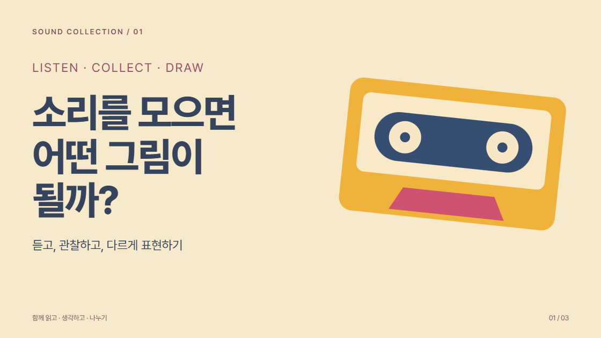

> “Sakura Chroma 스타일로 만들어 줘. 이 예시의 시각적 특징을 활용하되, 내용과 쓰는 공간은 내 수업에 맞게 구성해 줘.”

[편집 가능한 HTML](examples/sakura-chroma.html) · [HTML 바로 내려받기](https://github.com/pblsketch/slide-craft/raw/refs/heads/main/examples/sakura-chroma.html)

## 처음 사용하기

### 1. 사용하는 AI에 스킬 설치하기

#### Claude 웹·데스크톱

1. [Claude용 ZIP 내려받기](https://github.com/pblsketch/slide-craft/releases/latest/download/slide-craft-claude.zip)를 누릅니다. GitHub 전체 저장소 ZIP과는 다른 설치용 파일입니다.
2. Claude의 **Settings → Capabilities**에서 코드 실행·파일 생성을 켭니다.
3. **Customize → Skills → ＋ → Create skill → Upload a skill**에서 내려받은 ZIP을 올리고 활성화합니다.
4. 새 대화에서 “slide-craft 스킬로 자료를 만들어 줘”라고 말합니다.

메뉴가 보이지 않으면 계정·조직의 기능 설정을 확인하세요. [Claude 공식 설치 안내](https://support.claude.com/en/articles/12512180-use-skills-in-claude)를 기준으로 작성했습니다. Claude 화면 안의 미리보기에서 일부 조작이 제한되면 완성 HTML을 내려받아 Chrome·Edge에서 여세요.

#### Claude Code

같은 ZIP을 풀고 `slide-craft` 폴더 전체를 개인 스킬 폴더 `~/.claude/skills/`에 넣습니다. 최종 경로는 `~/.claude/skills/slide-craft/SKILL.md`입니다. 새 세션에서 `/slide-craft`으로 부르거나 자연어로 자료를 요청하세요. 프로젝트 전용 설치는 `.claude/skills/slide-craft/`를 사용합니다. [Claude Code 공식 안내](https://code.claude.com/docs/en/skills)

#### Codex

Codex에서 자료를 만드는 단계에는 **파일 작성·실행 기능과 Python 3.10 이상**이 필요합니다. 완성된 HTML을 열어 고치는 단계에는 브라우저만 있으면 됩니다. 일반 ChatGPT 대화창에 파일을 올리는 방식과는 설치 과정이 다릅니다.

Codex 대화창에 아래 문장을 붙여 넣으세요.

```text
$skill-installer https://github.com/pblsketch/slide-craft/tree/main/skills/slide-craft 에 있는 스킬을 설치해 줘.
```

설치 후 다음 대화에서 `$slide-craft`을 입력해 사용합니다. 목록에 보이지 않으면 새 세션을 열어 확인하세요. 이미 같은 이름으로 설치했다면 새로 설치하기보다 업데이트를 요청하세요.

스킬이 처음이라면 [OpenAI의 스킬 사용 안내](https://learn.chatgpt.com/docs/build-skills)를 참고하세요.

### 2. 만들고 싶은 자료 말하기

아래 예시를 그대로 복사하고 학년, 주제, 활동을 바꿔 보세요. 첫 줄은 Codex 기준입니다. Claude에서는 ‘slide-craft 스킬을 사용해 줘’, Claude Code에서는 `/slide-craft`으로 바꾸면 됩니다.

```text
$slide-craft
중학교 2학년 국어 수업 슬라이드를 만들어 줘.
주제는 광고의 주장과 근거이고, 수업 시간은 20분이야.
도입 질문, 가상 광고 비교, 짝과 문구 고치기, 정리 순으로 구성해 줘.
Bold Typography 스타일로 핵심 질문은 크게 보여 줘.
16:9 비율의 편집 가능한 HTML로 만들어 줘.
```

처음부터 스타일 이름을 알 필요는 없습니다. “여백이 넉넉하고 청록색을 조금만 써 줘”, “잡지처럼 제목과 본문의 크기 차이를 살려 줘”처럼 말해도 됩니다. 사용할 글, 사진, 조사표가 있다면 함께 제공하세요.

### 3. 열고, 고치고, 저장하기

1. AI가 만든 `.html` 파일을 내려받아 Chrome 또는 Edge로 엽니다.
2. 바꿀 글이나 표를 클릭하고 직접 입력합니다. 선택한 내용에 맞는 편집 도구가 상단에 나타납니다.
3. **HTML 저장**을 눌러 수정한 파일을 내려받습니다. 이 파일을 다시 열면 계속 편집할 수 있습니다.
4. **발표 보기**를 눌러 한 장씩 보여 줍니다. 유인물이 필요하면 **인쇄 / PDF**로 저장합니다.

**HTML 저장은 새 파일 다운로드입니다.** 원래 파일을 자동으로 덮어쓰지 않습니다. 창을 닫기 전에 저장하고, 내려받은 파일을 확인하세요.

## 직접 고칠 수 있는 것

### 글과 요소의 위치·크기 바꾸기

글을 클릭해 문구를 고치고 글꼴, 크기, 줄 간격, 정렬, 색을 조절합니다. 선택 영역의 **이동 손잡이**를 끌면 위치가 바뀌고, **모서리 손잡이**를 끌면 크기가 바뀝니다.

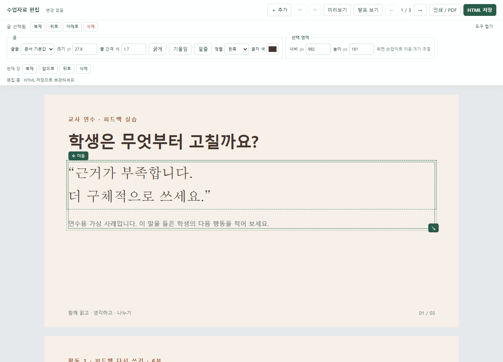

예를 들어 긴 질문을 두 줄로 줄인 뒤, 질문 영역을 넓히고 조금 아래로 옮길 수 있습니다. 손잡이를 선택한 상태에서 방향키로 1px, Shift+방향키로 10px씩 조절합니다. 끌던 중 Escape를 누르면 취소됩니다.

### 슬라이드를 복제하고 순서 바꾸기

현재 장을 복제하고 앞·뒤로 옮기거나 삭제합니다. “개인 생각 쓰기” 장을 복제해 “짝과 비교하기” 장으로 고칠 수 있습니다. 상단 **＋ 추가**에서는 글상자, 표, 답란, 이미지를 넣습니다.

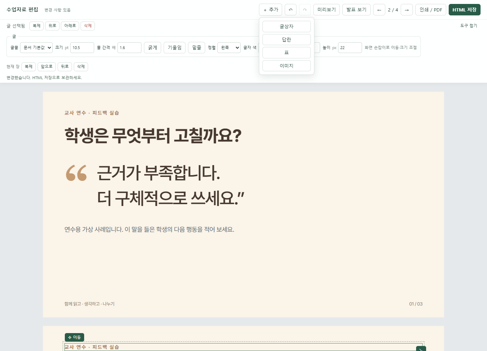

표는 셀 내용, 행·열, 너비와 높이를 편집합니다. 이미지는 선택 후 교체하고 비율을 유지하며 크기를 조절합니다. 차트나 복잡한 도식의 내부 데이터를 바꾸는 전용 도구는 없으므로 그런 수정은 HTML을 첨부해 AI에 요청하세요.

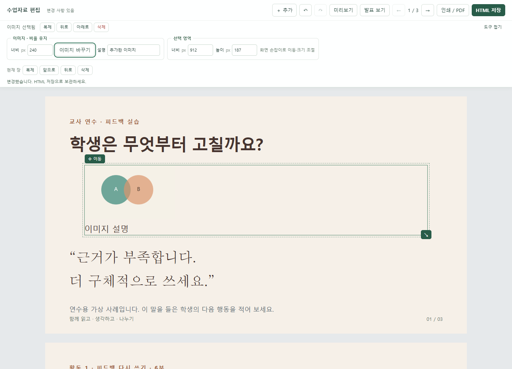

### 발표하고 PDF로 나누기

**발표 보기**를 누르면 한 장씩 표시하고 화살표 버튼으로 이동합니다. 브라우저 전체 화면과 함께 사용하면 수업 화면을 넓게 볼 수 있습니다. **인쇄 / PDF**에서는 편집 도구를 숨기고 전체 장을 출력합니다.

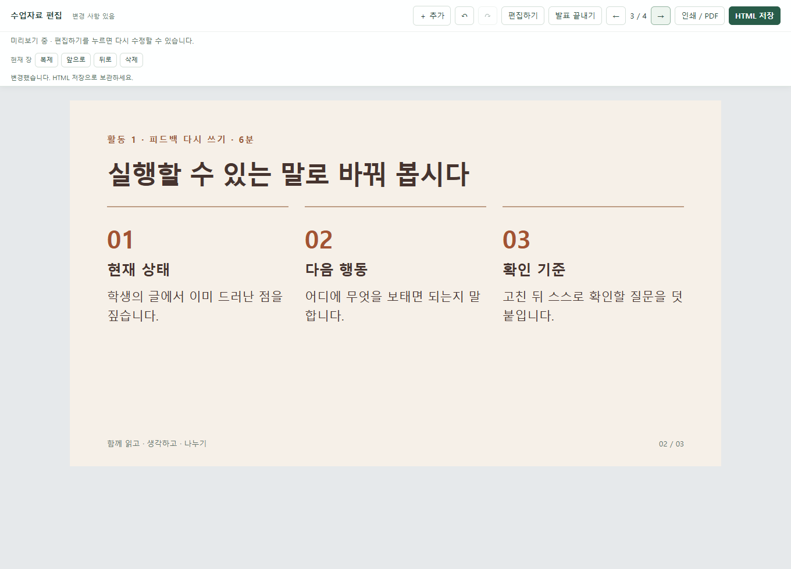

PDF는 브라우저 인쇄창에서 **PDF로 저장**을 선택합니다. 색이 빠지면 배경 그래픽 옵션을 켜고 머리글·바닥글을 끄세요. 편집을 이어가려면 HTML도 보관합니다. PowerPoint의 `.pptx` 내보내기는 이 스킬의 기본 기능이 아닙니다.

## 이렇게도 요청해 보세요

| 필요한 자료 | 그대로 바꿔 쓸 요청 예시 |
|---|---|
| 초등 도입 질문 | “초등 3학년용이야. 분류 기준을 찾는 수업 도입을 만들어 줘. 한 장에 질문 하나, 큰 글자와 간단한 그림을 써 줘.” |
| 중학교 국어 | “첨부한 두 광고의 주장과 근거를 비교하게 해 줘. 질문, 자료 비교, 짝 활동, 정리 순으로 구성해 줘.” |
| 교사 연수 | “30분 피드백 연수야. 사례 판단과 문장 고치기 실습을 넣고, 참여자가 무엇을 할지 각 활동에 적어 줘.” |
| 발표 축약 | “이 HTML을 10분 발표용으로 줄여 줘. 결론과 사례는 남기고 반복되는 설명을 합쳐 줘.” |
| 디자인 변경 | “내용은 유지하고 Warm Minimal로 바꿔 줘. 크림색 바탕에 갈색 포인트, 넓은 여백으로 정리해 줘.” |

학생이 쓸 종이 자료도 필요하다면 [Worksheet Craft](https://github.com/pblsketch/worksheet-craft)를 함께 사용할 수 있습니다. 활동지와 슬라이드는 각각 독립적으로 수정합니다.

## 수식도 직접 고치기

수식을 클릭하면 **LaTeX 원문과 실시간 미리보기**가 열립니다. 예를 들어 분수의 분모를 바꾸거나, 연립방정식의 계수를 고친 뒤 **적용**을 누릅니다. 잘못된 수식은 적용되지 않고 원래 수식이 남습니다.

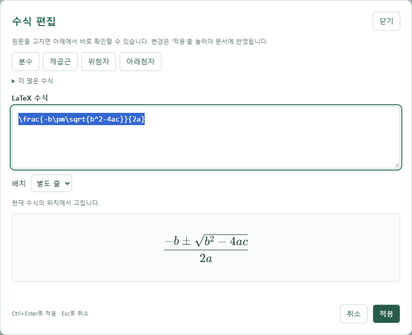

1. **＋ 추가 → 수식**으로 새 수식을 넣거나 기존 수식을 클릭합니다.
2. 분수·제곱근·위첨자·아래첨자 버튼을 사용합니다. **더 많은 수식**에는 연립식·행렬·합·적분·벡터·여러 줄 풀이가 있습니다.
3. 미리보기를 확인하고 **적용**합니다. 취소하면 원본을 유지하며, 적용 후에는 되돌리기도 가능합니다.
4. **HTML 저장**으로 내려받으면 인터넷 없이도 다시 열고 수식을 고칠 수 있습니다.

문장 안에 넣으려면 먼저 글에서 위치를 선택한 뒤 수식을 추가하세요. 별도 줄로도 배치할 수 있습니다. Ctrl+Enter는 적용, Esc는 취소입니다. 입력창에는 `$` 구분자 없이 수식만 적습니다.

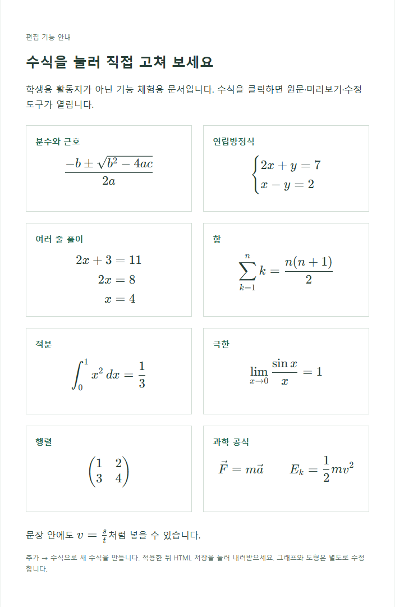

[수식 편집 체험 HTML](demos/math-editor.html) · [체험 파일 내려받기](https://github.com/pblsketch/slide-craft/raw/refs/heads/main/demos/math-editor.html)

이 체험 파일은 편집 기능을 보여 주는 자료입니다. 실제 수업 자료에는 해당 단원에 필요한 수식만 넣습니다. 기존 일반 텍스트나 임의의 MathML 수식이 자동으로 전환되지는 않습니다. 이전 파일은 AI에 편집기 갱신과 수식 변환을 요청하세요.

KaTeX 0.18.7과 수식 글꼴을 HTML 안에 포함합니다. 지원 범위는 [KaTeX 공식 목록](https://katex.org/docs/supported.html)을 따르며, 모든 LaTeX 패키지를 실행하는 기능은 아닙니다. 라이브러리의 [MIT 저작권 고지](skills/slide-craft/assets/freeform/katex-LICENSE.txt)를 배포 파일과 HTML 안에 보존합니다.

## 자주 묻는 질문

**HTML을 몰라도 쓸 수 있나요?**

네. 자료 생성은 대화로 요청하고 글·표·이미지는 브라우저에서 고칩니다. 전체 색상이나 복잡한 배치를 바꾸고 싶으면 수정한 HTML을 AI에 주고 변경할 부분을 말하세요. HTML/CSS를 아는 분은 파일을 직접 수정해도 됩니다.

**인터넷 없이 열 수 있나요?**

완성된 자료에는 편집기와 이미지가 파일 안에 포함됩니다. 파일을 열고 고치는 데 별도 서버나 로그인이 필요하지 않습니다. AI에 새 자료 생성을 요청하는 단계에는 인터넷이 필요합니다.

**제공된 스타일만 쓸 수 있나요?**

아닙니다. 갤러리는 디자인을 설명하는 출발점입니다. 스타일 선택 버튼이나 고정 양식 세트를 제공하는 방식이 아닙니다. 색, 글꼴, 배치, 장 수를 요청에 맞게 구성합니다. 이 예시에 쓰인 서체나 색상을 다음 자료에 강제하지 않습니다. 참고 이미지를 주거나 두 방향을 섞어 달라고 할 수도 있습니다.

**동료에게 보내도 편집되나요?**

네. 저장한 HTML 자체를 보내면 동료도 브라우저에서 고칠 수 있습니다. 실시간 공동 편집이나 클라우드 자동 저장 기능은 없습니다. PDF는 인쇄·배포용이며, 편집을 이어가려면 HTML도 보관하세요.

**되돌리기는 어디까지 되나요?**

열어 둔 탭에서 최근 20개 편집 상태를 기억합니다. Ctrl+Z로 되돌리고 Ctrl+Shift+Z로 다시 적용합니다. 이 기록은 파일에 저장되지 않으므로 다시 연 뒤 이전 세션의 편집을 되돌릴 수는 없습니다.

**직접 편집할 수 없는 것도 있나요?**

표의 셀 병합·분할, 이미지 자르기, 복잡한 도형 내부 점이나 그래프 데이터의 전용 편집은 제공하지 않습니다. 병합된 표는 글과 서식·행 높이를 고칠 수 있지만 행·열 추가·삭제와 열 너비 변경은 제한됩니다. 수식은 KaTeX 편집창에서 고칠 수 있습니다. 수식을 바꿔도 그래프가 자동으로 바뀌지는 않습니다.

## 예시와 사용 범위

이 저장소의 글과 도형은 예시를 위해 작성했습니다. 디자인과 지면 구성에 참고한 자료와 반영 내용은 [디자인 참고 기록](docs/design-notes.md)에 정리했습니다. 가상 광고·설문·학생 반응은 각 자료에 표시했습니다. 다른 책의 활동지나 사진을 재배포하지 않습니다. 예시 HTML에는 본문용 Pretendard 글꼴을 포함합니다. 일부 명조 제목은 시스템 글꼴을 사용하므로 운영체제에 따라 모양이 달라질 수 있습니다. 포함한 글꼴은 별도의 [SIL Open Font License](docs/Pretendard-OFL.txt)를 따르며, 라이선스는 각 HTML 안에도 들어 있습니다.

코드, 문서, 포함된 예시는 [MIT 라이선스](LICENSE)로 공개합니다. 수정·재배포·상업적 이용이 가능하며, 재배포할 때 라이선스와 저작권 고지를 유지해 주세요. 선생님이 별도로 추가하는 글·사진은 해당 자료의 이용 조건을 따릅니다.

## 제작 방식을 살펴보고 싶다면

`skills/`에는 생성 지침, 디자인 판단 기준, 편집기와 HTML 연결 스크립트가 있습니다. `examples/`에는 브라우저에서 바로 편집할 수 있는 완성 예시가 있고, `docs/images/`에는 실제 HTML에서 촬영한 화면이 있습니다.

예시를 만드는 명령과 확인한 항목은 [검증 기록](docs/verification.md)에 정리했습니다. 사용 중 문제가 생기면 Issues에 상황과 재현 방법을 남겨 주세요.
